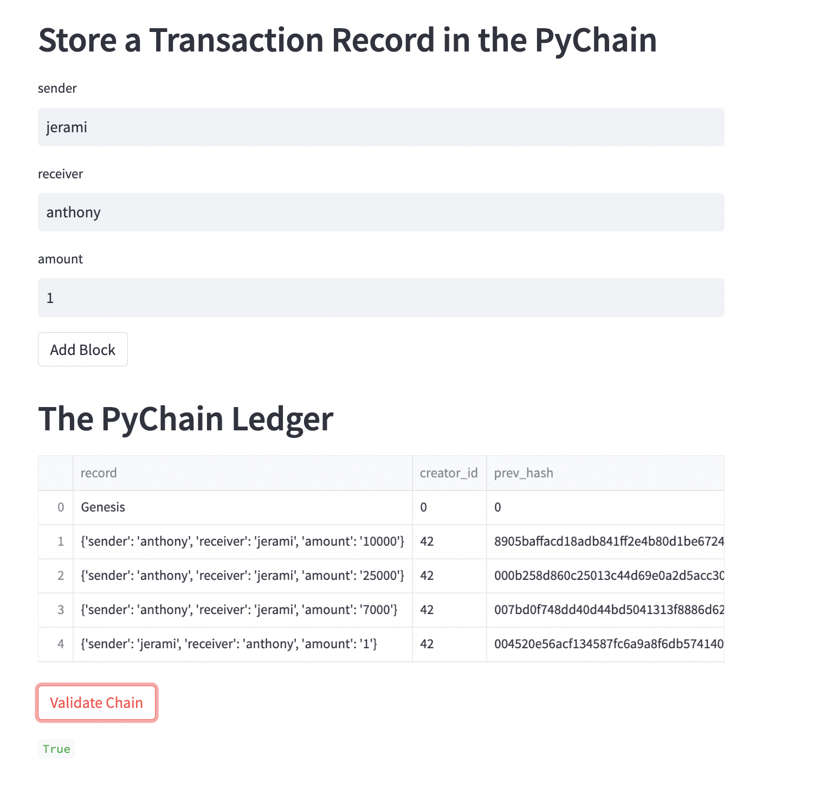
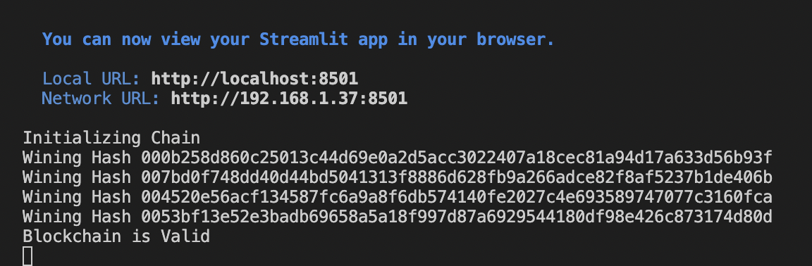

# PyChain Ledger

## Description

You’re a fintech engineer who’s working at one of the five largest banks in the world. You were recently promoted to act as the lead developer on their decentralized finance team. Your task is to build a blockchain-based ledger system, complete with a user-friendly web interface. This ledger should allow partner banks to conduct financial transactions (that is, to transfer money between senders and receivers) and to verify the integrity of the data in the ledger.

The UI allows a user to input the sender, receiver, and amount of a transaction and add as a new block. The blockchain can then be validated. 

